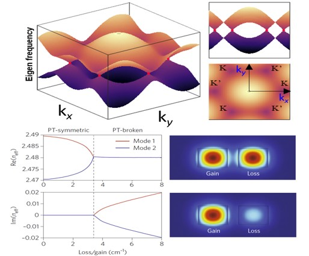
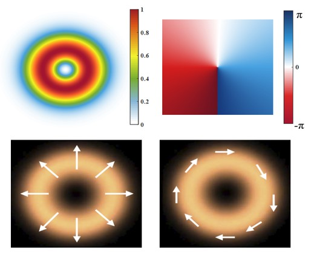
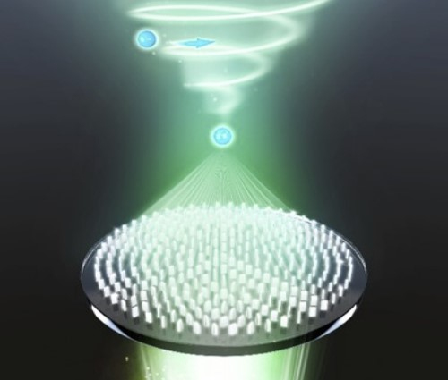
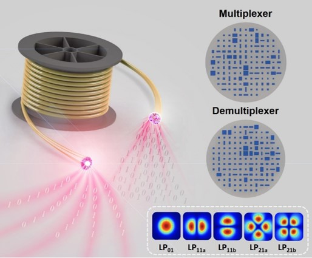
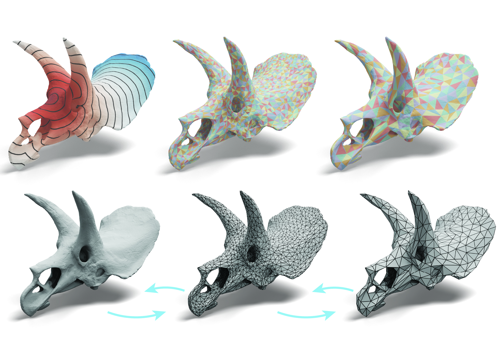
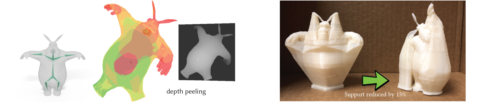

About me
======
Hi! I am currently a Research Fellow with the Department of Physics at the Jockey Club Institute of Advanced Study, The Hong Kong University of Science and Technology (HKUST), working in the group of Prof. <a href="https://facultyprofiles.hkust.edu.hk/profiles.php?profile=che-ting-chan-phchan">Che Ting Chan</a>. I earned my Ph.D. in Optical Physics from Nanjing University, China.

My research centers on Nanophotonics, focusing on the physical mechanisms and optical singularities in light-matter interactions. I aim to advance this field by exploring new frontiers in light-field manipulation, topological photonics, and optomechanics. I am also actively developing versatile nano-devices for on-chip and fiber-based platforms, with applications in optical tweezers, optical communication, photonic waveguiding circuits, and imaging.

<h3>Call for Papers & Conference Participation</h3>

<strong>Special Issue:</strong> We are co-hosting a Special Issue titled “<a href="https://www.mdpi.com/journal/photonics/special_issues/HPH62OU5VY">Metasurfaces and Meta-Devices: From Fundamentals to Applications</a>” in the journal <em>Photonics</em>. The submission deadline is *April 30, 2026*. Original research and review articles relevant to the theme are welcome.

<strong>Conference Session:</strong> I am co-chairing the session “<a href="https://suzhou2026.piers.org/session.html?sid=S013">Multifunctional Metasurfaces: Fundamentals and Applications</a>” at the *Progress In Electromagnetics Research Symposium (PIERS 2026, Suzhou, China)*. We invite abstract submissions for oral presentations. A limited number of invited talk slots are available; interested speakers are welcome to <a href="mailto:[lity@ust.hk]">contact me</a> for further information.

Fundamental Research
======

<strong>Singularities of Eigenstates</strong>

  

 

Photonic band is a typical eigenvalue in optical system. Singularity occurs at the degenerate points of more than two energy bands, also known as Dirac point. The eigenvalues around Dirac points enriches physical connotations, such as the accompanying quantum spin Hall effect and quantum valley Hall effect with topological properties. Meanwhile, the photonic structures existing in open or gain-loss systems will split in the complex plane, and its non-Hermitian Hamiltonian  has also aroused our interest, aiming to find the connections between these eigenvalues. 

 

<strong>Singularities of Light Fields</strong>

  

 

The light field is comprised of various physical properties, including wavelength, polarization, and phase. These parameters are subject to discontinuity, resulting in a cutoff point known as an optical singularity. Our research interests lie in two specific forms of optical singularities: the phase singularity carried by vortex fields and the polarization singularity arising from the momentum space. We aim to gain a deeper understanding of the physical mechanisms associated with these singularities within the light field. 

 

Derivative Applications
======

<strong>Versatile Nano-optomechanics for Meta-manipulation</strong>

  

 

Optical forces can be generated along with the light-matter interaction. Thanks to the overlap between the microstructure science and optical micromanipulation, the planar optical tweezers we developed based on plasmonic devices and metasurfaces enable to confine light into diffraction-limit level, so as to control Rayleigh particles with the ultracompact size; On the other hand, with the development of micro-nano manufacturing, we show the micro-structural materials based on photon-momentum transfer, named metavehicles. Our further research concentrates on the development of integrated on-chip optical tweezers and the mechanism of microstructural resonance. 

 

<strong>Advanced Optical communication and endoscopy</strong>

  

 

Optical communication plays an important role in communication and imaging. Although optical fiber possess the abilities of lossless and low cost, it is difficult to operate separately because of its small size and limited mode utilization. We have jointly developed some devices based on cross section of the end of fiber, which can adjust and control the fiber mode, further simplifying the size of devices after mode separation, and saving space costs for increasing communication channels and ultracompact imaging devices. 

 

 

Publications
======

<!--  -->

- &nbsp; [__Scalable generalized meta-spanners enabling parallel multitasking optical manipulation__](https://arxiv.org/abs/2510.13146) 
&nbsp; __Tianyue Li†__, Wenyu Gao†, Boyan Fu†, Tianhua Shao, Yuchao Fu, Siarhei Zavatski, Jeeban Kumar Nayak, Shaohui Yan, Xiaohao Xu, Shuming Wang, Baoli Yao, Zhenlin Wang, Shining Zhu, Olivier J. F. Martin, C. T. Chan  
&nbsp; *Arxiv*, 2510.13146, 2025  

- &nbsp; [__Configurable topological photonic polycrystal based on a synthetic hybrid dimension__](https://academic.oup.com/nsr/advance-article/doi/10.1093/nsr/nwaf107/8092649?searchresult=1) 
&nbsp; __Tianyue Li†__, Mengjiao Liu†, Jin Qin†, Jiahao Hou, Jianzheng Ren, Yang Liu, Xing Yang, Hongchen Chu, Yun Lai, Shuming Wang, Jian-Hua Jiang, C. T. Chan, Shining Zhu.  
&nbsp; *National Science Review*, 12 (6), nwaf107, 2025  

- &nbsp; [__Metasurface-integrated pattern-preserved fiber mode separator__](https://advanced.onlinelibrary.wiley.com/doi/10.1002/adfm.202505081)  
&nbsp; Haotian Xu†, __Tianyue Li†__, Geze Gao†, Shaochen Fang†, Hanwen Liu, Haotian Ding, Xi Chen, Yifeng Xiong, Ye Chen, Shuming Wang, Fei Xu.  
&nbsp; *Advanced Functional Materials*, 2505081, 2025  

- &nbsp; [__Miniaturized high-efficiency snapshot polarimetric stereoscopic imaging__](https://doi.org/10.1364/OPTICA.549864) 
&nbsp; Boyan Fu†, Xuxi Zhou†, __Tianyue Li†__, Hao Zhu, Zhen Liu, Shiyu Zheng, Yifan Zhou, Yiwan Yu, Xun Cao, Shuming Wang, Zhenlin Wang, Shining Zhu.  
&nbsp; *Optica*, 12 (3), 391-398, 2025  

- &nbsp; [__Configurable Optical Dirac Cavity Based on Topological Metasurfaces (Invited)__](https://www.opticsjournal.net/Articles/OJfaf9bd22b5f1d178/Abstract) 
&nbsp; Huiying Liang, Jiahao Hou, __Tianyue Li\*__, Shuming Wang\*.  
&nbsp; *Acta Optica Sinica (Online)*, 2(7): 0709001, 2025  

- &nbsp; [__Harnessing optical forces with advanced nanophotonic structures: principles and applications (Invited)__](https://link.springer.com/article/10.1186/s11671-025-04252-4?utm_source=rct_congratemailt&utm_medium=email&utm_campaign=oa_20250503&utm_content=10.1186/s11671-025-04252-4) 
&nbsp; Geze Gao†, Tianhua Shao†, __Tianyue Li\*__, Shuming Wang\*.  
&nbsp; *Discover Nano*, 20, 76, 2025  

- &nbsp; [__Metasurface-assisted multimodal quantum imaging__](https://www.pnas.org/doi/10.1073/pnas.2500760122#tab-contributors) 
&nbsp; Yifan Zhou, Xiaoshu Zhu, __Tianyue Li__, Zhou Zhou, Qianhui Bi, Jun Liu, Jian Chen, Boyan Fu, Juanzi He, Xinyang Feng, Xiaojing Feng, Xingyu Liu, Qianjin Wang, Shuming Wang, Zhenlin Wang, Cheng-Wei Qiu, Shining Zhu.  
&nbsp; *PNAS*, 122 (18), e2500760122, 2025  

- &nbsp; [__Topological selective non-hermitian skin effect__](https://wulixb.iphy.ac.cn/article/doi/10.7498/aps.74.20250526)  
&nbsp; Xing Yang, Mengjiao Liu, Jiahao Hou, __Tianyue Li__, Shuming Wang.  
&nbsp; *Acta Physica Sinica*, 74 (14), 144205, 2025  

- &nbsp; [__Ultrafast metaphotonics__](https://spj.science.org/doi/10.34133/ultrafastscience.0074) 
&nbsp; __Tianyue Li†__, Haotian Xu†, Mingcheng Panmai†, Tianhua Shao, Geze Gao, Fei Xu, Guangwei Hu, Shuming Wang, Zhenlin Wang, Shining Zhu.  
&nbsp; *Ultrafast Science*, 4, 0074, 2024  

- &nbsp; [__Chip-scale metaphotonic singularities: topological, dynamical, and practical aspects__](https://www.sciencedirect.com/science/article/pii/S2709472324000273?via%3Dihub)  
&nbsp; __Tianyue Li†__, Mengjiao Liu†, Jiahao Hou, Xing Yang, Shubo Wang, Shuming Wang, Shining Zhu, Din Ping Tsai, Zhenlin Wang.  
&nbsp; *Chip*, 3 (4), 100109, 2024  

- &nbsp; [__Spin-selective tri-functional metasurfaces for deforming versatile non-diffractive beams along the optical trajectory__](../files/LPR.2024.2301372.Spin-Selective Trifunctional Metasurfaces for Deforming Versatile Nondiffractive Beams along the Optical Trajectory.pdf) 
&nbsp; __Tianyue Li†__, Yun Chen†, Boyan Fu†, Mengjiao Liu, Jinwen Wang, Hong Gao, Shuming Wang, Shining Zhu.  
&nbsp; *Laser & Photonics Reviews*, 2301372, 2024  

- &nbsp; [__Realization of spinful metaphotonic stokes skyrmions (Invited)__](../files/JO.26.09LT01.Realization of spinful metaphotonic stokes skyrmions.pdf) 
&nbsp; __Tianyue Li__, Mengjiao Liu, Chen Chen, Xingyi Li, Jiahao Hou, Xing Yang, Shuming Wang, Shining Zhu.  
&nbsp; *Journal of Optics*, 26, 09LT01, 2024  

- &nbsp; [__On-demand quick metasurface design with neighborhood attention transformer__](https://arxiv.org/abs/2412.08405) 
&nbsp; Zhi Sun†, __Tianyue Li†__, Shiqi Kuang†, Xue Yun, Minru He, Boyan Fu, Yunlai Fu, Tianyu Zhao, Shaowei Wang, Yansheng Liang, Shuming Wang, Ming Lei.  
&nbsp; *Arxiv*, 2412.08405, 2024  

- &nbsp; [__Metasurfaces empowered optical micromanipulation (on the cover)__](../files/超构表面赋能光学微操控技术.pdf) 
&nbsp; Xiaohao Xu, Wenyu Gao, __Tianyue Li__, Tianhua Shao, Xingyi Li, Yuan Zhou, Geze Gao, Guoxi Wang, Shaohui Yan, Shuming Wang, Baoli Yao.  
&nbsp; *Acta Optica Sinica*, 44 (5), 050001, 2024  

- &nbsp; [__Miniature snapshot midinfrared spectrometer based on metal-insulator-metal metasurface__](https://iopscience.iop.org/article/10.1088/2040-8986/ad5359) 
&nbsp; Weijun Liu, Yuanqing Wan, Haoxiang Yu, Quan Yuan, __Tianyue Li__, Fang Xue, Shuming Wang.  
&nbsp; *Journal of Optics*, 26, 085003, 2024  

- &nbsp; [__Reversible lateral optical force on phase-gradient metasurfaces for full control of metavehicles (Editor's pick)__](../files/OL.48.255.2022.Reversible lateral optical force on phase-gradient metasurfaces for full control of metavehicles.pdf) 
&nbsp; __Tianyue Li__, Jack J. Kingsley-Smith, Yanhui Hu, Xiaohao Xu, Shaohui Yan, Shuming Wang, Baoli Yao, Zhenlin Wang, Shining Zhu.  
&nbsp; *Optics Letters*, 48 (2), 255-258, 2023  

- &nbsp; [__Polarization-dependent optical forces arising from Fano interference__](../files/AdvPhysRes.2023.2200048.Polarization‐Dependent Optical Forces Arising from Fano Interference.pdf) 
&nbsp; Yao Zhang†, __Tianyue Li† (equal contribution)__, Shuming Wang, Zhenlin Wang, Shining Zhu.  
&nbsp; *Advanced Physics Research*, 2200048, 2023  

- &nbsp; [__Dual-wavelength chiral metasurfaces based on quasi-bound states in the continuum__](https://iopscience.iop.org/article/10.1088/2040-8986/acbc32/pdf) 
&nbsp; Run Chen, Qianhui Bi, __Tianyue Li__, Shuming Wang, Shining Zhu, Zhenlin Wang.  
&nbsp; *Journal of Optics*, 25, 045001, 2023  

- &nbsp; [__Phase Mechanism and Progress of Multifunctional Metasurfaces (on the cover)__](../files/光学学报.42.2126004.2022.多功能超构表面的相位调控机制及研究进展.pdf) 
&nbsp; Mengjiao Liu, __Tianyue Li__, Qin Ge, Shuming Wang, Zhenlin Wang, Shining Zhu.  
&nbsp; *Acta Optica Sinica*, 42 (21), 2126004, 2022  

- &nbsp; [__Steerable Chromatic Dispersive Metalenses in Dual Bands__](../files/JPD.55.255105.Steerable chromatic dispersive metalenses in dual bands.pdf) 
&nbsp; Boyan Fu, __Tianyue Li__, Xiujuan Zou, Jianzheng Ren, Quan Yuan, Shuming Wang, Xun Cao, Zhenlin Wang, Shining Zhu.  
&nbsp; *Journal of Physics D: Applied Physics*, 55, 255105, 2022  

- &nbsp; [__Quasi-bound states in the continuum-based switchable light-field manipulator__](../files/OME.12.1232.Quasi-bound states in the continuum-based switchable light-field manipulator.pdf) 
&nbsp; Run Chen, __Tianyue Li__, Qianhui Bi, Shuming Wang, Shining Zhu, Zhenlin Wang.  
&nbsp; *Optical Materials Express*, 12 (3), 1232, 2022  

- &nbsp; [__Wavelength-dependent multifunctional metalens devices via genetic optimization__](../files/OME.11.3908. Wavelength-dependent multifunctional metalens devices via genetic optimization..pdf) 
&nbsp; Jianzheng Ren, __Tianyue Li__, Boyan Fu, Shuming Wang, Zhenlin Wang, Shining Zhu.  
&nbsp; *Optical Materials Express* 11 (11), 3908-3916, 2021  

- &nbsp; [__Integrating the optical tweezers and spanner onto an individual single-layer metasurface__](../files/PR. Integrating the optical tweezers and spanner onto an individual single-layer metasurface.pdf) 
&nbsp; __Tianyue Li__, Xiaohao Xu, Boyan Fu, Shuming Wang, Baojun Li, Zhenlin Wang, Shining Zhu.  
&nbsp;  *Photonics Research* 9 (6), 1062-1068, 2021 
<!-- &nbsp; [*Journal-Artice*](../files/PR. Integrating the optical tweezers and spanner onto an individual single-layer metasurface.pdf)  -->

- &nbsp; [__Generation and conversion dynamics of dual Bessel beams with a photonic spin-dependent dielectric metasurface__](../files/PhysRevApplied.Generation and Conversion Dynamics of Dual Bessel Beams with a Photonic Spin-Dependent Dielectric Metasurface.pdf) 
&nbsp; __Tianyue Li__, Xingyi Li, Shaohui Yan, Xiaohao Xu, Shuming Wang, Baoli Yao, Zhenlin Wang, Shining Zhu.  
&nbsp;  *Physical Review Applied* 15 (1), 014059, 2021 
<!-- &nbsp;  [*Journal-Artice*](../files/PhysRevApplied.Generation and Conversion Dynamics of Dual Bessel Beams with a Photonic Spin-Dependent Dielectric Metasurface.pdf) 
 -->

- &nbsp; [__Multidimensional light field manipulation and applications based on optical metasurface__](../files/SPIE Conference.Multidimensional light field manipulation and applications based on optical metasurface.pdf) 
&nbsp; __Tianyue Li__, Boyan Fu, Jianzheng Ren, Shuming Wang, Zhenlin Wang, Shining Zhu.  
&nbsp;  *First Optics Frontier Conference* 11850, 1185004, 2021 
<!-- &nbsp;  [*Conference-Paper*](../files/SPIE Conference.Multidimensional light field manipulation and applications based on optical metasurface.pdf) 
 -->

- &nbsp; [__Chromatic Dispersion Manipulation Based on Metalenses__](../files/AM.Chromatic Dispersion Manipulation Based on Metalenses.pdf) 
&nbsp; Wenbo Zang, Quan Yuan, Run Chen, Lin Li, __Tianyue Li__, Xiujuan Zou, Gaige Zheng, Zhuo Chen, Shuming Wang, Zhenlin Wang, Shining Zhu.  
&nbsp;  *Advanced Materials* 32 (27), 1904935, 2020 
<!-- &nbsp;  [*Journal-Artice*](../files/AM.Chromatic Dispersion Manipulation Based on Metalenses.pdf) 
 -->

- &nbsp; [__Imaging based on metalenses__](../files/Photonix. Imaging based on metalenses.pdf) 
&nbsp; Xiujuan Zou, Gaige Zheng, Quan Yuan, Wenbo Zang, Run Chen, __Tianyue Li__, Lin Li, Shuming Wang, Zhenlin Wang, Shining Zhu.  
&nbsp;  *PhotoniX* 1 (1), 1-24, 2020 
<!-- &nbsp;  [*Journal-Artice*](../files/Photonix. Imaging based on metalenses.pdf) 
 -->

- &nbsp; [__Chromatic dispersion manipulation based on metasurface devices in the mid-infrared region__](../files/COL.Chromatic dispersion manipulation based on metasurface devices in the mid-infrared region.pdf) 
&nbsp; Lin Li, Quan Yuan, Run Chen, Xiujuan Zou, Wenbo Zang, __Tianyue Li__, Gaige Zheng, Shuming Wang, Zhenlin Wang, Shining Zhu.  
&nbsp;  *Chinese Optics Letters* 18 (8), 082401, 2020 
<!-- &nbsp;  [*Journal-Artice*](../files/COL.Chromatic dispersion manipulation based on metasurface devices in the mid-infrared region.pdf)  -->

- &nbsp; [__A measuring method for eccentricity of railway bridge line and thickness of ballast__](../files/railway.pdf) 
&nbsp;__Tianyue Li__, Zimo Cheng, Ziqian Chen, Yuanjun Li.  
&nbsp;  *Railway Engineering* 2018 (2), 134-137, 2018 (in Chinese) 
<!-- &nbsp;  [*Journal-Artice*](../files/railway.pdf)  -->

- &nbsp; [__Automatic precise alignment of Sagnac interferometer__](../files/Automatic precise alignment of Sagnac interferome.pdf) 
&nbsp;__Tianyue Li__, Xuemin Zhang and Xing Song.   
&nbsp;  *Novel Optoelectronic Detection Technology and Application* 10697, 106973L, 2018 
<!-- &nbsp;  [*Conference-Paper*](../files/Automatic precise alignment of Sagnac interferome.pdf) 
 -->
 
<!--  -->

<!-- Industry Experience
======

&nbsp; __Creative Intelligence Lab, Adobe Research__ 
&nbsp; Research Intern with Dr. [Danny Kaufman](http://dannykaufman.io/) 
&nbsp; *<h style="color:rgb(150, 150, 150);font-size:16px">Project: Multi-Resolution Simulation</h>  *
&nbsp; &nbsp; &nbsp; &nbsp; &nbsp; &nbsp; &nbsp; &nbsp; &nbsp; &nbsp; &nbsp; &nbsp; &nbsp;
&nbsp; &nbsp; &nbsp; &nbsp; &nbsp; &nbsp; &nbsp; &nbsp; &nbsp; &nbsp; &nbsp; &nbsp; &nbsp; &nbsp;
&nbsp; &nbsp; &nbsp; &nbsp; &nbsp; &nbsp; &nbsp; &nbsp; &nbsp; &nbsp; &nbsp; &nbsp; &nbsp;&nbsp; &nbsp; &nbsp; &nbsp; &nbsp; &nbsp; &nbsp; &nbsp; &nbsp; &nbsp; &nbsp; &nbsp;May 2021 - Aug. 2021 
 

&nbsp; __Emerging Graphics Group, Adobe Research__ 
&nbsp; Research Intern with Dr. [Qi Sun](https://qisun.me/) 
&nbsp; *<h style="color:rgb(150, 150, 150);font-size:16px">Project: Skin Modeling</h>  *
&nbsp; &nbsp; &nbsp; &nbsp; &nbsp; &nbsp; &nbsp; &nbsp; &nbsp; &nbsp; &nbsp; &nbsp; &nbsp;
&nbsp; &nbsp; &nbsp; &nbsp; &nbsp; &nbsp; &nbsp; &nbsp; &nbsp; &nbsp; &nbsp; &nbsp; &nbsp; &nbsp;
&nbsp; &nbsp; &nbsp; &nbsp; &nbsp; &nbsp; &nbsp; &nbsp; &nbsp; &nbsp; &nbsp; &nbsp; &nbsp;&nbsp; &nbsp; &nbsp; &nbsp; &nbsp; &nbsp; &nbsp; &nbsp; &nbsp; &nbsp; &nbsp;June 2020 - Sept. 2020 

  -->

<!-- Teaching Experience
======
&#9679; __Teaching Assistant__, University of Toronto 
&nbsp; &nbsp; [CSC419/2520 Geometry Processing](https://github.com/alecjacobson/geometry-processing-csc2520) with Prof. [Alec Jacobson](https://www.cs.toronto.edu/~jacobson/)
&nbsp; &nbsp; &nbsp; &nbsp; &nbsp; &nbsp; &nbsp; &nbsp; Sept. 2020 - Jan. 2021 

  -->

<!-- Selected Projects
======

<strong>Fast Support Reduction</strong>

 In layer-based 3D fabrication, supporting structures are fabricated
to support overhanging regions yet discarded later. Reducing supports
saves both time and material cost. In this project, we propose 
a real-time skinning-based method to slim down the
supporting structure while maintaining a detailed-preserved and semantically meaningful geometry.
We achieve this by optimizing a set of performance objectives and searching globally in
the subspace spanned by the joint handles. Artifacts e.g. self-intersection can be effectively avoided.
Our method is implemented via OpenGL shaders and has potential to be
employed as a structural prototyping tool that facilitates model design and fabrication. 

 -->

Contact
======
__E-mail:__ lity@ust.hk
 
 
<!--__Address:__ Room A-411, Cyrus Tang Building, School of Physics, Nanjing University.-->
 

