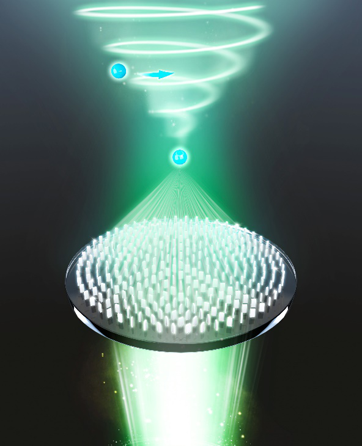
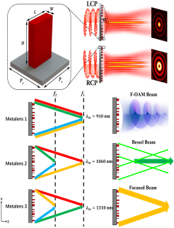
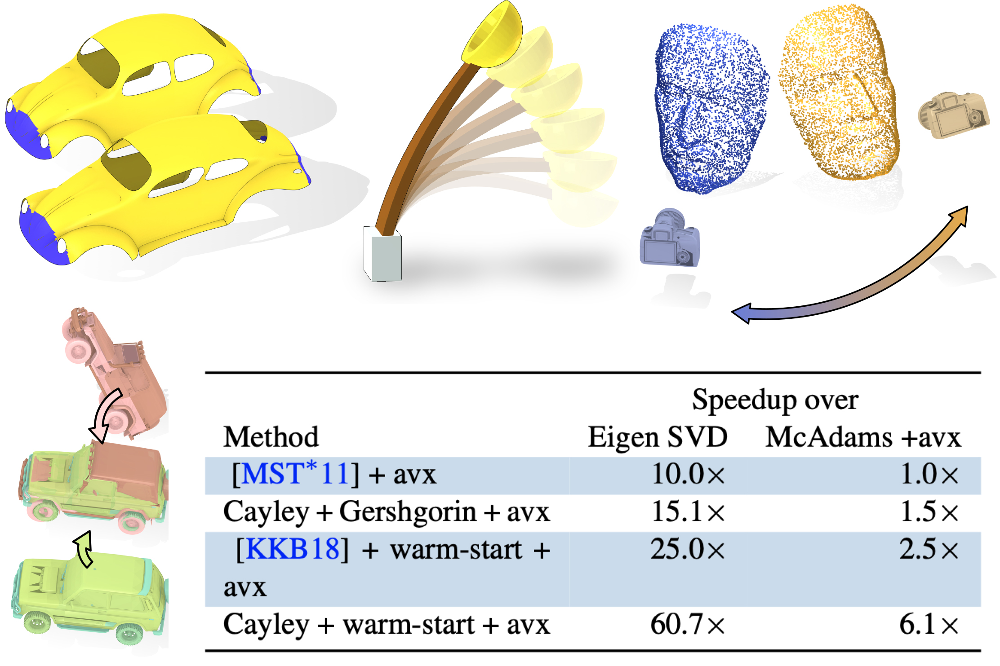

About me
======
Hiya, I'm a doctoral student at the Nanjing University, China, currently majoring in Optics and Photonics in [Dielectric Superlattice Lab.](http://slab.nju.edu.cn/)  guided by  [Prof. Zhu Shining](http://slab.nju.edu.cn/teamdetail.aspx?id=16), and advised by  >[Prof. Shuming Wang](https://physics.nju.edu.cn/sz/gdkxx/20191105/i45277.html)

My research interests mainly focus on the field of Nanophotonics, specifically the physical mechanism of metasurface, multifunctional meta-device design, Metalenses design for imaging and topological photonics in non-Hermite system. In parallel, I also study on optical manipulation based on metasurface with Prof. Shaohui Yan (XIOPM) and Dr. Xiaohao Xu (Jinan Univ. Guangzhou), and expected to discover something new in classic and quantum physics..

Also, I've previously participated in different research areas with Prof. Houjun Lü (Guangxi Univ.) on High Energy Astrophysics and with Prof. Ziqian Chen (Guangxi. Univ.) on optical gauge as well as precise alignment of interferometers with Prof. Xuemin Zhang (Wuhan Univ.).

I'm honored to be selected as an 'Outstanding Speaker' in 2nd National Academic Forum on Photonics Technology and Awarded Second Prize of Presentation Contest in The 1st 'Light & Future' National Graduate Academic Forum.

<!-- __Update: I will be joining Stanford University as a Ph.D. student in Fall 2021!__ -->

 

Research area
======

<strong>Metasurface-based Optical manipulation</strong>

  

 

Optical tweezers (OT) and optical spanner (OS) are powerful tools of optical manipulation, which are responsible for particle trapping and rotation, respectively. Conventionally, the OT and OS are built using bulky three-dimensional devices, such as microscope objectives and spatial light modulators. Recently, metasurfaces are proposed for setting up them on a microscale platform, which greatly miniaturizing the systems. In this topic, we offer a metasurface-based solution to integrating the OT and OS. Using the prevailing approach based on the geometric and dynamic phases, we show that it is possible to construct an output field, which promises a high-numerical-aperture focal spot, accompanied with a coaxial vortex. Optical trapping and rotation are numerically demonstrated by estimating the mechanical effects on a particle probe. Moreover, we demonstrate an on-demand control of the OT-to-OS distance and the topological charge possessed by the OS. By revealing the OT-OS metasurfaces, our results may empower advanced applications in on-chip particle manipulation.

  

 

<strong>Multidimensional Light-field Manipulation with Metasurfaces</strong>

  

 

Metalens possessing the advantages of miniaturized size, are widely employed to manipulate light in the subwavelength region, which breaks the limitation of bulky and complex volume and system compared to the traditional optical elements. An advantage of metasurfaces is their versatility by invoking the degrees of freedom of light field to achieve various functionalities into a single-layer metalens. In this project, we report methods of using the polarization and dispersion of light to achieve multifunctional metasurface devices, allowing the different degrees of freedom of light to carry independent phase profiles to achieve the polarization-dependent conversion of Bessel beams with different orders and numerical apertures as well as wavelength-controlled multifunctional metalenses by introducing an improved genetic algorithm have been implemented. We envision our research are expected to be the potential candidates in multifunctional integrated optical devices.

  

 

<strong>Chromatic Dispersion Manipulation Based on Metalenses</strong>

  

 

Among all the optical elements, the metalenses possess most basic and important application, compared with the traditional lenses, it has significant advantages in integration and miniaturization. However, the resonant dispersion of each nanostructure, the inherent dispersion of planar devices and optical materials lead to large chromatic aberrations in the metalenses, that severely reduces the quality of their focusing and imaging. Therefore, how to effectively suppress or manipulate the chromatic aberration of metalenses has attracted worldwide attention in recent years, and various excellent achievements have promoted the development of this field. In this project, the Differencial-phase equation has been employed to design the achromatic or super chromatic metalenses, which provides the possibility for the development of ultrathin full-color camera or spectral imaging devices.

  

 

Publications
======

&nbsp; __Surface Multigrid via Intrinsic Prolongation__ 
&nbsp;  Hsueh-Ti Derek Liu, __Jiayi Eris Zhang__, Mirela Ben-Chen, Alec Jacobson 
&nbsp;  *ACM SIGGRAPH 2021* 
&nbsp;  [Paper](../files/surface-multigrid-high.pdf) | [Paper (low res)](https://arxiv.org/abs/2009.02462) 

 

&nbsp; __Fast Updates for Least-Squares Rotational Alignment__ 
&nbsp;  __Jiayi Eris Zhang__, Alec Jacobson, Marc Alexa 
&nbsp;  *Eurographics 2021* 
&nbsp;  [Paper](https://www.dgp.toronto.edu/projects/fast-rotation-fitting/nosvd.pdf) | [Project Page](https://www.dgp.toronto.edu/projects/fast-rotation-fitting/) | [Code](https://github.com/ErisZhang/fast-rotation-fitting)

 

&nbsp; __Complementary Dynamics__  
<!-- &nbsp;  __Jiayi Eris Zhang__, [Seungbae Bang](https://sites.google.com/view/seungbaebang/home), [David I.W. Levin](http://diwlevin.webfactional.com/researchdb/), [Alec Jacobson](https://www.cs.toronto.edu/~jacobson/)   -->
&nbsp;  __Jiayi Eris Zhang__, Seungbae Bang, David I.W. Levin, Alec Jacobson  
&nbsp;  *ACM SIGGRAPH ASIA 2020* 
&nbsp;  [Paper](https://eriszhang.github.io/files/complementary-dynamics-paper.pdf) | [Paper (low res)](https://arxiv.org/abs/2009.02462) | [Project Page](https://www.dgp.toronto.edu/projects/complementary-dynamics/) | [Talk](https://www.youtube.com/watch?v=Oh2fZGmfYew&t=6s) 
&nbsp; **Featured in the  <a href="https://www.youtube.com/watch?v=Q45KT0lGd7A" style="color:rgb(232, 60, 37);font-size:16px">Technical Papers Trailer</a>* *and <a href="https://www.youtube.com/watch?v=s8Nm_ytwO6w&feature=youtu.be" style="color:rgb(232, 60, 37);font-size:16px">Two Minute Papers</a>*  

 

&nbsp; __DataQuilt: Extracting Visual Elements from Images to Craft Pictorial__ 
&nbsp; __Visualizations__ 
&nbsp;  __Jiayi Eris Zhang__, Nicole Sultanum, Anastasia Bezerianos, Fanny Chevalier 
&nbsp;  *ACM CHI 2020* 
&nbsp;  [Paper](https://eriszhang.github.io/files/dataquilt-paper.pdf) | [Project Page](https://dataquilt.github.io/) | [Talk](https://www.youtube.com/watch?v=0K6ZiQ78otA&t=4s) 

 

<!-- Industry Experience
======

&nbsp; __Creative Intelligence Lab, Adobe Research__ 
&nbsp; Research Intern with Dr. [Danny Kaufman](http://dannykaufman.io/) 
&nbsp; *<h style="color:rgb(150, 150, 150);font-size:16px">Project: Multi-Resolution Simulation</h>  *
&nbsp; &nbsp; &nbsp; &nbsp; &nbsp; &nbsp; &nbsp; &nbsp; &nbsp; &nbsp; &nbsp; &nbsp; &nbsp;
&nbsp; &nbsp; &nbsp; &nbsp; &nbsp; &nbsp; &nbsp; &nbsp; &nbsp; &nbsp; &nbsp; &nbsp; &nbsp; &nbsp;
&nbsp; &nbsp; &nbsp; &nbsp; &nbsp; &nbsp; &nbsp; &nbsp; &nbsp; &nbsp; &nbsp; &nbsp; &nbsp;&nbsp; &nbsp; &nbsp; &nbsp; &nbsp; &nbsp; &nbsp; &nbsp; &nbsp; &nbsp; &nbsp; &nbsp;May 2021 - Aug. 2021 
 

&nbsp; __Emerging Graphics Group, Adobe Research__ 
&nbsp; Research Intern with Dr. [Qi Sun](https://qisun.me/) 
&nbsp; *<h style="color:rgb(150, 150, 150);font-size:16px">Project: Skin Modeling</h>  *
&nbsp; &nbsp; &nbsp; &nbsp; &nbsp; &nbsp; &nbsp; &nbsp; &nbsp; &nbsp; &nbsp; &nbsp; &nbsp;
&nbsp; &nbsp; &nbsp; &nbsp; &nbsp; &nbsp; &nbsp; &nbsp; &nbsp; &nbsp; &nbsp; &nbsp; &nbsp; &nbsp;
&nbsp; &nbsp; &nbsp; &nbsp; &nbsp; &nbsp; &nbsp; &nbsp; &nbsp; &nbsp; &nbsp; &nbsp; &nbsp;&nbsp; &nbsp; &nbsp; &nbsp; &nbsp; &nbsp; &nbsp; &nbsp; &nbsp; &nbsp; &nbsp;June 2020 - Sept. 2020 

  -->

<!-- Teaching Experience
======
&#9679; __Teaching Assistant__, University of Toronto 
&nbsp; &nbsp; [CSC419/2520 Geometry Processing](https://github.com/alecjacobson/geometry-processing-csc2520) with Prof. [Alec Jacobson](https://www.cs.toronto.edu/~jacobson/)
&nbsp; &nbsp; &nbsp; &nbsp; &nbsp; &nbsp; &nbsp; &nbsp; Sept. 2020 - Jan. 2021 

  -->

<!-- Selected Projects
======

<strong>Fast Support Reduction</strong>

 In layer-based 3D fabrication, supporting structures are fabricated
to support overhanging regions yet discarded later. Reducing supports
saves both time and material cost. In this project, we propose 
a real-time skinning-based method to slim down the
supporting structure while maintaining a detailed-preserved and semantically meaningful geometry.
We achieve this by optimizing a set of performance objectives and searching globally in
the subspace spanned by the joint handles. Artifacts e.g. self-intersection can be effectively avoided.
Our method is implemented via OpenGL shaders and has potential to be
employed as a structural prototyping tool that facilitates model design and fabrication. 

 -->

 

Contact
======
jiayieris.zhang (at) mail.utoronto.ca
